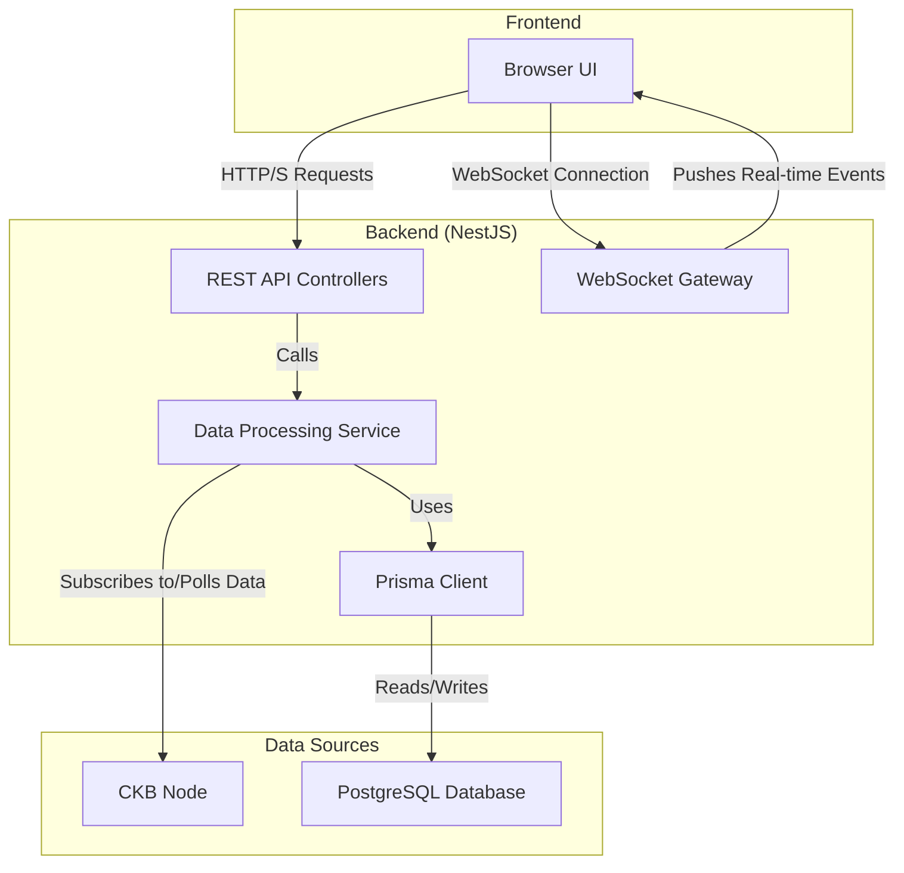

# Technical Specification

## 1. Project Overview

This document provides a detailed design and implementation plan for the CKB (Nervos Network) Chaining View backend service. Inspired by blockchain explorers like TxStreet, this project aims to offer users an intuitive, real-time visualization of transaction and block activity on the CKB network.

The backend service is the core component, responsible for fetching on-chain data from a CKB node, processing and storing it, and serving it to a front-end application via a WebSocket and REST API.

## 2. System Architecture

The system employs a modular architecture, comprising a CKB Node, the Backend Service, and a PostgreSQL Database.



### Component Descriptions

-   **CKB Node**: The single source of truth for blockchain data. The backend service will connect to its RPC/WebSocket endpoint to subscribe to new blocks and mempool transactions.
-   **Backend Service (NestJS)**:
    -   **Data Processing Service**: Contains the core logic. It connects to the CKB node, fetches raw data, transforms it into the database schema format, and persists it.
    -   **API Controllers**: Expose RESTful endpoints for the frontend to query historical or detailed data (e.g., block details, transaction details).
    -   **WebSocket Gateway**: Manages persistent connections with clients, pushing real-time events for new blocks, transaction state changes, etc.
    -   **Prisma Client**: The ORM layer, providing a type-safe interface for database interactions.
-   **PostgreSQL Database**: Persistently stores the processed blockchain data.

## 3. Data Model (Prisma Schema)

We will use Prisma to define and manage our database schema. The following is the proposed `schema.prisma`.

```prisma
// schema.prisma

generator client {
  provider = "prisma-client-js"
}

datasource db {
  provider = "sqlite"
  url      = env("DATABASE_URL")
}

model Block {
  id               Int           @id @default(autoincrement())
  hash             String        @unique
  number           BigInt        @unique
  timestamp        DateTime
  miner            String
  reward           BigInt
  transactionCount Int
  proposalsCount   Int
  unclesCount      Int
  size             BigInt
  transactions     Transaction[]
  proposals        Json
  uncles           Json
  version          Int
  parentHash       String
  compactTarget    String
  nonce            String
  epoch            String
  dao              String

  createdAt DateTime @default(now())
  updatedAt DateTime @updatedAt
}

model Transaction {
  id          Int      @id @default(autoincrement())
  hash        String   @unique
  block       Block?   @relation(fields: [blockId], references: [id])
  blockId     Int?
  status      TxStatus @default(PENDING)
  fee         BigInt
  size        BigInt
  cycles      BigInt
  version     Int
  cellDeps    Json
  headerDeps  Json
  witnesses   Json
  inputs      Json
  outputs     Json
  outputsData Json

  createdAt DateTime @default(now())
  updatedAt DateTime @updatedAt
}

enum TxStatus {
  PENDING   // In mempool
  PROPOSED  // In proposal zone
  CONFIRMED // Included in a finalized block
}
```

### Model Notes

-   **Block**: Stores header information for each block. Fields like `transactionCount` are stored directly to facilitate the `block.finalized` event payload.
-   **Transaction**: Stores detailed transaction data. The `status` field tracks its lifecycle. `fee`, `size`, and `cycles` are added as explicit fields for efficient querying and to align with the API specification.

## 4. API Endpoints

The API is divided into a WebSocket interface for real-time events and a REST API for state queries, closely following the design of `API_SPEC.md`.

### 4.1. WebSocket API

-   **Endpoint**: `ws://your-api-domain.com/`
-   **Communication**: Clients subscribe to channels by sending a JSON message. The server pushes event messages to subscribed clients.

-   **Client -> Server Message**:
    ```json
    {
      "action": "subscribe" | "unsubscribe",
      "channel": "chain" | "transactions"
    }
    ```

-   **Server -> Client Message**:
    ```json
    {
      "channel": "chain" | "transactions",
      "type": "event.name",
      "payload": { ... }
    }
    ```

#### Channel: `chain`

-   **Event: `block.finalized`**: Fired when a new block is added to the canonical chain.
    -   **Payload**: Includes block summary and a list of transaction summaries.
-   **Event: `chain.reorg`**: Fired when a chain reorganization is detected.
    -   **Payload**: Includes reorg depth and the new/old chain tips.

#### Channel: `transactions`

-   **Event: `transaction.pending`**: A transaction enters the mempool.
-   **Event: `transaction.proposed`**: A transaction is included in a block's proposal zone.
-   **Event: `transaction.confirmed`**: A transaction is confirmed on-chain.
-   **Event: `transaction.rejected`**: A transaction is rejected by the mempool. (This event is pushed but the transaction is not stored in the DB).

### 4.2. HTTP REST API

-   **Base URL**: `/api/v1`
-   **Data Types**: All hashes and large integers are returned as strings.

#### Endpoints

-   **`GET /chain/info`**: Retrieves high-level information about the blockchain's current state.
-   **`GET /mempool/info`**: Retrieves statistics about the transaction mempool (e.g., counts, size, fee rates).
-   **`GET /mempool/transactions`**: Retrieves a list of transactions currently in the mempool.
    -   **Query Params**: `status=pending|proposed`, `limit`, `page`.
-   **`GET /blocks`**: Retrieves a paginated list of the most recent blocks.
-   **`GET /blocks/:hash`**: Retrieves detailed information for a single block by its hash.
-   **`GET /transactions/:hash`**: Retrieves detailed information for a single transaction by its hash.

## 5. Data Synchronization and Processing

This is the core logic of the backend service.

1.  **Initialization**: On startup, the service connects to the CKB node's subscription endpoint.
2.  **Historical Sync (Optional)**: A separate script can be implemented to backfill historical blocks and transactions from a specified height into the database.
3.  **Real-time Subscription**:
    -   The service subscribes to CKB's `new_transaction` and `new_tip_header` topics.
    -   **On `new_transaction`**: The service fetches the full transaction details. A `Transaction` record is created in the database with `status: PENDING`. A `transaction.pending` event is pushed via the WebSocket.
    -   **On `new_tip_header`**:
        1.  The service fetches the full block data using the header's hash.
        2.  A `Block` record is created in the database.
        3.  For each transaction hash in the block's `proposals`, the corresponding `Transaction` record in the DB is updated to `status: PROPOSED`. A `transaction.proposed` event is pushed.
        4.  For each transaction in the block's `transactions`, the corresponding DB record is updated to `status: CONFIRMED`. A `transaction.confirmed` event is pushed.
        5.  Finally, a `block.finalized` event is pushed with the full block summary.
4.  **Handling Reorganizations**: The service must track the canonical chain. When a `new_tip_header` points to a block whose parent is not the previous tip, a reorg is detected. The service must:
    -   Identify the detached blocks.
    -   Revert the status of transactions within those blocks (e.g., from `CONFIRMED` back to `PENDING`).
    -   Process the new canonical blocks.
    -   Push a `chain.reorg` event to notify clients.

## 6. Technology Stack

-   **Framework**: [NestJS](https://nestjs.com/)
-   **ORM**: [Prisma](https://www.prisma.io/)
-   **Database**: [PostgreSQL](https://www.postgresql.org/)
-   **Language**: [TypeScript](https://www.typescriptlang.org/)
-   **CKB SDK**: [Lumos](https://lumos-website.vercel.app/)

---
*This document was generated by an AI coding assistant.* 